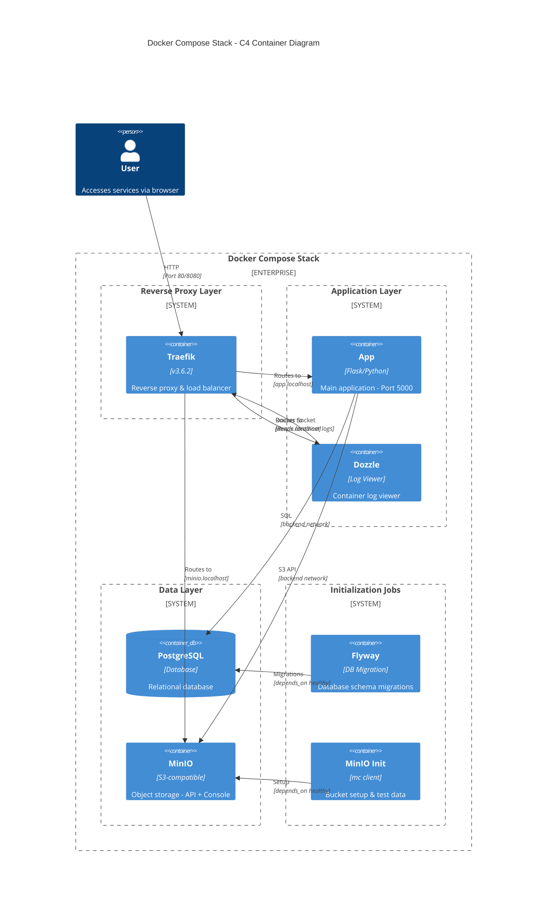

# Summary

This Compose stack provides a reproducible environment for development, test, and staging.  
It includes a reverse proxy, database with migrations, S3 storage, a log viewer, and a demo application—all wired together with Traefik routing and environment-variable-based configuration.


# TLDR;

## Clone the repository
`git clone https://github.com/JahnConsulting/docker-compose-stack.git` 


## Create the required environment file
`cd docker-compose-stack`  
`touch .env`

### Set credentials

POSTGRES_PASSWORD=  
POSTGRES_USER=  
MINIO_ROOT_PASSWORD=  
MINIO_ROOT_USER=  
MINIO_ACCESS_KEY=  
MINIO_SECRET_KEY=  


## Start the stack (dev mode)
  `docker compose   --env-file dev.env    --env-file .env    --profile dev up -d`

  

---

## Install dependencies
`python3 -m venv .venv`   
`source .venv/bin/activate`  
`pip install -r requirements.txt`  

## Run the app

`(set -a && source dev.env && source .env && set +a && python app.py)`  
URL: http://127.0.0.1:5000
# Overview

This repository provides a full Docker Compose stack for a demo application.  
The stack includes:

- Traefik v3 (reverse proxy)

- Postgres + Flyway (schema & migrations)

- MinIO (S3-compatible file storage)

- MinIO initialization job

- Dozzle (log viewer)

- Example app (Flask-based)


The stack supports multiple stages via profiles:

- **dev** – run the app locally in the IDE, infrastructure in Docker

- **test** – app runs inside Docker with migrations + test data

- **stage** – same structure as test, production-like without persistence rules


The Compose file relies heavily on environment variables. Stages are configured via `STAGE` and corresponding `*.env` files.

---

## Running the Stack

### Requirements

- Repository cloned

- Docker installed

- Required external networks created (`web`)

- `.env` file containing secrets (never committed)

- `<stage>.env` file specifying stage-specific config (dev/test/stage)


### Start the stack

Example for **test**:

```text 
docker compose   --env-file test.env    --env-file .env    --profile test up -d
```
### Stop the stack

docker compose \   --env-file test.env \   --env-file .env \   --profile test down

### Stop and remove volumes

docker compose \   --env-file test.env \   --env-file .env \   --profile test down -v

---

## URLs

All services are routed through Traefik based on hostnames:

- Traefik Dashboard: `http://traefik.lvh.me`

- Example App: `http://app.lvh.me`

- MinIO API: `http://minio-api.lvh.me`

- MinIO Console: `http://minio-console.lvh.me`

- Dozzle: `http://dozzle.lvh.me`

- Postgres: `localhost:5432`


These values must be defined per stage in the respective `.env` file.

---

# Service Details

## Traefik

Reverse proxy for all HTTP traffic.  
Configured via Docker labels and dynamic config directory.

Key points:

- Dashboard enabled for dev/test/stage

- Routes based on host rules

- Uses external network `web`

- Logs written to `./logs`


---

## Postgres

PostgreSQL instance with automatic healthcheck and persistent volume.

- Schema is created via Flyway (see below)

- Ports are mapped from host → container

- Runs on networks `backend` and `web` (Traefik routing if needed)


Environment variables come from the stage env file + secrets from `.env`.

---

## Flyway (schema migrations)

### `flyway` (test, stage)

Runs schema migrations before the app starts.

- Uses migrations from `./flyway/sql`

- Waits for Postgres readiness


### `flyway-dev` (dev)

Same as above, but includes additional migration location:

- `./flyway/sql/dev`


This allows development-only migrations or fixtures.

---

## Example App

Simple Flask-based API container.

- Depends on Postgres and MinIO (healthchecked)

- Exposes port **5000** internally

- Routed via Traefik using label-defined router

- Reads DB + MinIO config from environment variables

- Connects through `backend` and `web` networks


Healthcheck ensures the app responds locally on port 5000.

---

## MinIO

S3-compatible storage with console UI.

- Bucket initialization handled by a separate init job

- Exposes API and console via individual Traefik routers

- Sensitive credentials from `.env`

- Data persists via `minio_data` volume


### MinIO Init Job

`minio-init` runs after MinIO becomes healthy:

- Creates required bucket

- Uploads sample files (`static/file-1.txt`, etc.)

- Single-run job, no restart


---

## Dozzle

Web-based log viewer for all containers.

- Mapped via Traefik

- Uses `/var/run/docker.sock` (read-only)

- Useful for development and debugging


---

# Networks

The stack defines two networks:

`web:   external: true backend:   internal: true`

### web (external)

Must be created manually:

`docker network create web`

Used for:

- Traefik

- Any service exposed via HTTP


### backend (internal)

Internal-only network for communication between services:

- Postgres

- Flyway

- MinIO

- App


Traefik cannot access internal services unless explicitly attached.

---

# Volumes

The stack uses two persistent volumes:

- `postgres_data` – database data

- `minio_data` – S3 bucket data


Deletion requires running `docker compose … down -v`.

---

# Environment Variables

### Secrets stored in `.env`

Never committed.

Required keys:
```text
POSTGRES_PASSWORD= 
POSTGRES_USER= 
MINIO_ROOT_PASSWORD= 
MINIO_ROOT_USER= 
MINIO_ACCESS_KEY= 
MINIO_SECRET_KEY=
```
### Stage-specific env (e.g. dev.env, test.env)

Contains:

- STAGE

- APP_NAME

- hostnames

- ports

- image tags


No secrets.

---

# Development vs Test

## Development Mode

Profile: `dev`

- App is **not** run inside Docker

- You run the app locally via IDE

- Flyway uses `sql` + `sql/dev`

- Infrastructure only (DB, MinIO, Traefik, Dozzle)


## Test/Stage Mode

Profile: `test` or `stage`

- App runs in Docker

- Flyway runs schema migrations automatically

- Sample data + test files are loaded

- Full stack for integration testing

---

# Architecture

## C4 Container Diagram



## Stack Overview

| Layer | Services | Networks |
|-------|----------|----------|
| **Proxy** | Traefik | web |
| **Application** | App, Dozzle | web, backend |
| **Data** | PostgreSQL, MinIO | web, backend |
| **Initialization** | Flyway, MinIO-Init | backend |

## Service Dependencies

- **App** → PostgreSQL (healthy), MinIO (healthy)
- **Flyway** → PostgreSQL (healthy)
- **MinIO-Init** → MinIO (healthy)


